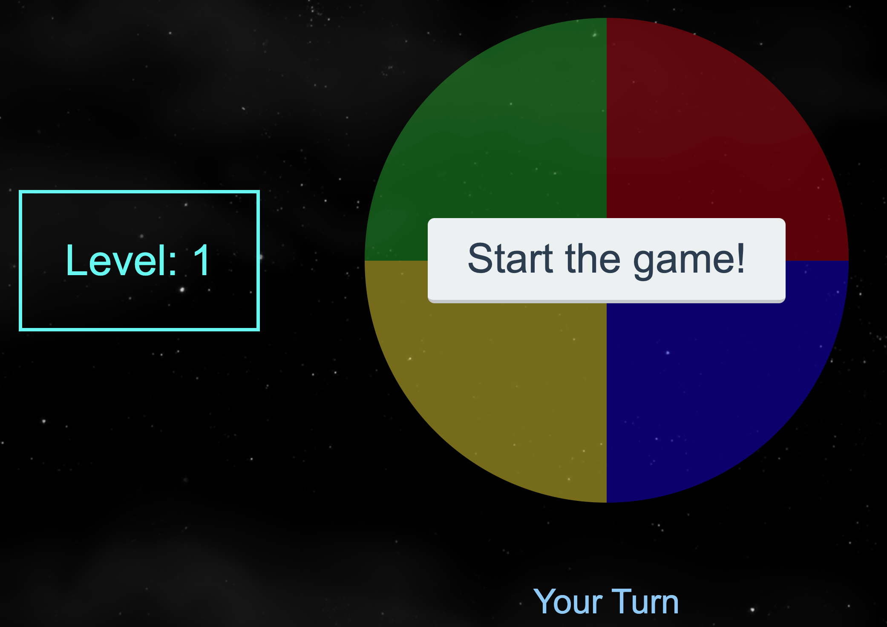

# Simon Says - JavaScript game. 🎮

 

This game was created by applying fundamental concepts in Javascript and in the Web arena. In the process, I reviewed topics such as Asynchronism, Callbacks, HTML DOM events & Promises.

## Live demo
<Play game> : https://ginogustavo.github.io/SimonSays

## Instructions:
This is the regular Simon Says game, where you follow every button Simons illuminates, as you complete the sequence, you will get one more button to add in your memory and follow to get to the next step. There are by default 10 levels.

## Technologies
* JavaScript
* HTML
* CSS

## External libraries:
Sweet Alert

## Author ✒️
Gino Ureta

You are more welcome to like and fork it as you need.
